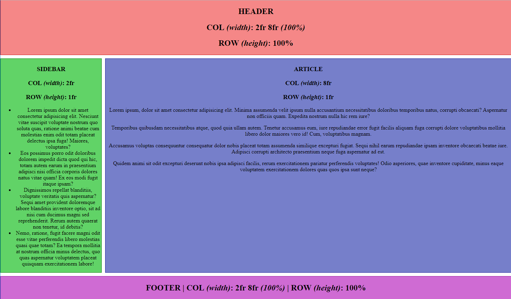

# Tuto CSS : <code>DISPLAY: GRID;</code>

Lien vers le tuto : <a href="https://www.grafikart.fr/tutoriels/html-css/grid-css-1002">https://www.grafikart.fr/tutoriels/html-css/grid-css-1002</a>

## Objectif : créer un template en grille facilement avec le display grid

Aperçu :

